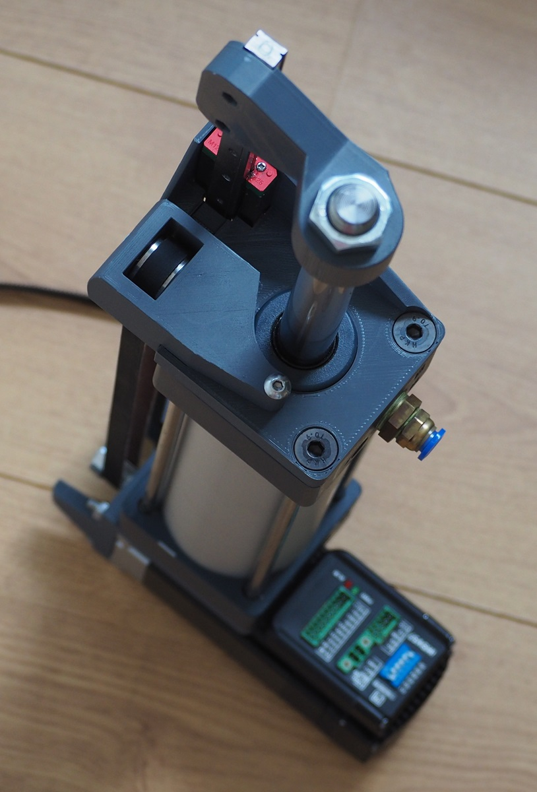
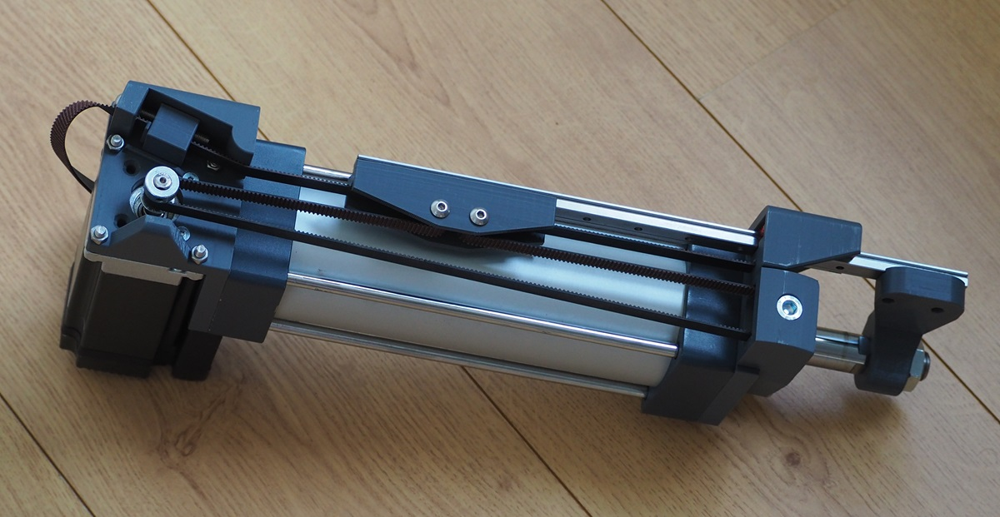
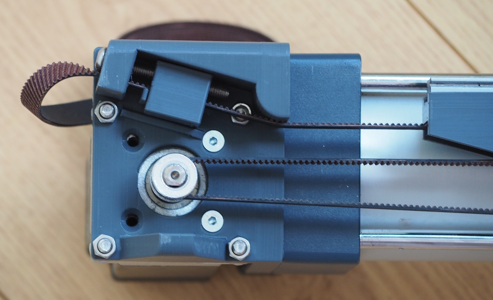

# Project description

This is a pneumatic actuator intended to drive venus 2000 style sex toys. 
The large bore diameter and 2:1 pulley reducer makes this design relatively compact. 
A powerful NEMA23 servo motor, borrowed from the OSSM project, handles control.

Keep fingers away during operation.

# Bill Of Materials

Mechanical parts:

1. SC63-150 pneumatic cylinder from aliexpress. I generally use about 60% of travel.
2. MGN12H Rail and bearing, 250mm or 300mm (300mm in pics). If you use any longer rail, it will stick out in the front.
3. NEMA23 motor. I use IHSV57 180W.
4. 8x MR115-2RS 5x11x4mm bearings
5. 2x 608 8x22x7mm bearings
6. 2MGT timing belt, about 1m. Design allows for a maximum belt width of 10mm.
7. 20-tooth 2MGT pulley. You must use 20-tooth or the pulley mechanism will bind.

Nuts and bolts:

1. 2x M3 6mm cap head for linear rail.
2. 4x M3 8mm for rail idler, any head type. 
3. 2x M3 8~16mm for piston arm, any head type.
4. 6x M3 nut.
5. 1x M5 30mm button or cap head for tracking adjustment.
6. 1x M5 30~50mm button or cap head for tensioner.
7. 2x M5 24~27mm button or cap head for rail idler, button head preferred.
8. 2x M5 nut.
9. 1x M8 25mm cap head for idler. Can be substituted for 8x30mm pin (modify design yourself).
10. 5x M8 20mm countersink for mounting the big prints to the cylinder.
11. Something to mount the motor. 4x M4 16+mm countersink, or various short M5 nuts/bolts.

Electronics/software:

Not part of this design. You could use the OSSM reference board.

Plumbing:

I use 5x8mm aquarium tubing, which is almost certainly too small. Additional testing needed. 
Original venus uses approx 9mm ID, NimbleStroker 16mm ID. 

# Printing

All parts can be printed without supports, bridging mode required.

The rail idler and rail arm benefit from being printed in a creep-resistant material such as ABS, otherwise the M3 bolts require daily re-tightening.

The front idler can use extra top/bottom layers.

Rest can be printed with default settings.

# Assembly instructions

The rail-mounted idler needs to be oriented with the cutout towards the front.

Depending on printer tolerance and cylinder squareness, the motor may need shims to make sure it's perpendicular to the belt path.

The tensioner insert must be inserted from the back, or it may slip. If you can't insert the tensioner, make it 5% / 0.1mm thinner and try again.

After assembly, loosen and re-tighten the bolts securing the linear rail to ensure it's parallel to the piston.
