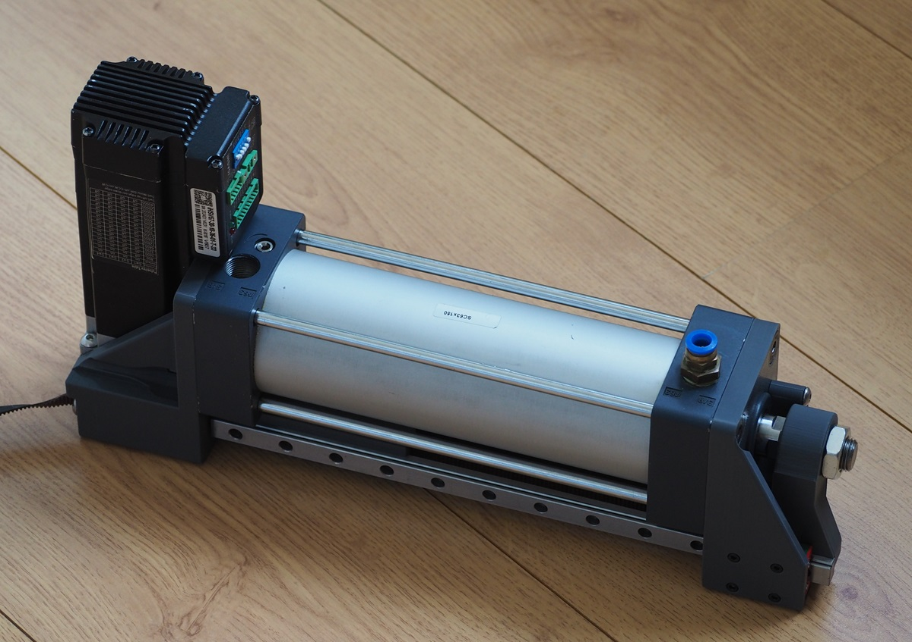

# Project description

This is a pneumatic actuator intended to drive venus 2000 style sex toys. 
The large bore diameter and 2:1 pulley reducer makes this design relatively compact. 
A powerful NEMA23 servo motor, borrowed from the OSSM project, handles control.

Keep fingers away during operation.

# Bill Of Materials

Mechanical parts:

1. SC63-150 pneumatic cylinder from aliexpress.
2. MGN12H Rail and bearing, 250mm or 300mm (300mm in pics). If you use any longer rail, it will stick out in the front.
3. NEMA23 motor. I use IHSV57 180W.
4. 8x MR115-2RS 5x11x4mm bearings
5. 2x 608 8x22x7mm bearings
6. 2MGT timing belt, 1 meter. Design allows for a maximum belt width of 10mm.
7. 20-tooth 2MGT pulley. You must use 20-tooth or the pulley mechanism will bind.

Nuts and bolts:

1. 4x M3 6mm cap head for linear rail.
2. 4x M3 8mm for rail idler, any head type. 
3. 2x M3 8~16mm for piston arm, any head type.
4. 6x M3 nut.
5. 1x M5 30mm button or cap head for tracking adjustment.
6. 1x M5 30~50mm button or cap head for tensioner.
7. 2x M5 24~27mm button or cap head for rail idler, button head preferred.
8. 2x M5 nut.
9. 1x M8 50mm cap head for idler. Can be substituted for 8x30mm pin (modify design yourself).
10. 5x M8 20mm countersink for mounting the big prints to the cylinder.
11. Something to mount the motor. 4x M4 16+mm countersink, or various short M5 nuts/bolts.

Electronics/software:

Not part of this design. You could use the OSSM reference board.

Plumbing:

I use 5x8mm aquarium tubing, which is almost certainly too small. Additional testing needed. 
Original venus uses approx 9mm ID, NimbleStroker 16mm ID. 

Here are some numbers about volume:

| part                                                      | volume |
|-----------------------------------------------------------|--------|
| SC63-150 pneumatic cylinder                               | 460 ml |
| venus 2000 (8.2cm diameter * 4cm displacement, estimated) | 211 ml |
| tremblr (6.3cm diameter * 7cm displacement, estimated)    | 218 ml |
| 1 meter of 5mm id tubing                                  | 20 ml  |
| 1 meter of 9mm id tubing                                  | 63 ml  |
| 1 meter of 16mm id tubing                                 | 200 ml |
| venus 2000 receiver (5cm * 16cm)                          | 314 ml |

I find myself using between 60% and 80% of the SC63-150 volume, so I'm a bit surprised the 
volume of the commercial devices is so low.

For tubing, you'd want to choose large enough tubing such that air resistance
isn't a significant factor, 
and small enough tubing not to add much volume to the system since
extra air makes the system less responsive.

# Printing

All parts can be printed without supports, bridging mode required.

The rail idler and rail arm benefit from being printed in a creep-resistant material such as ABS, otherwise the M3 bolts require daily re-tightening.

The front idler should be printed with 3x the normal amount of top/bottom layers.

Rest can be printed with default settings.

# Assembly instructions

The rail-mounted idler needs to be oriented with the cutout towards the front.

Depending on printer tolerance and cylinder squareness, the motor may need shims to make sure it's perpendicular to the belt path.

The tensioner insert must be inserted from the back, or it may slip. If you can't insert the tensioner, make it 5% / 0.1mm thinner and try again.

After assembly, loosen and re-tighten the bolts securing the linear rail to ensure it's parallel to the piston.

# Changelog

26/06/2024 Update front idler design with longer bolt, added washer to put between bearings.