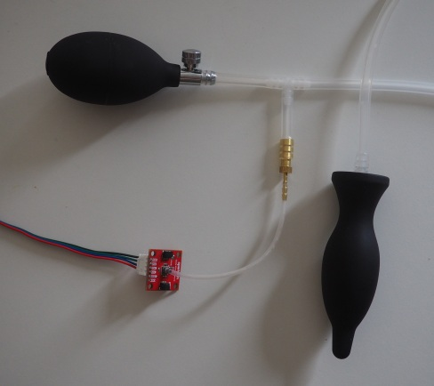
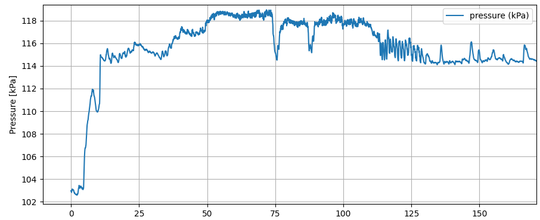

# Project description

Pressure sensor for butts. Commonly used in nogasm/protogasm/Edge-o-matic
devices. 

To my surprise, I found only sparse documentation on the construction
of such a sensor.



# BOM

* inflatable buttplug. "nipple shape" seems to be preferred by Edge-o-Matic folks.
  * https://aliexpress.com/item/1005005855766230.html
  * Pump 5mm-7.2mm barb, plug 4.9-6.5mm (tip, max)
  * The hose delivered with the plug has 5mm ID, but I found it to be a bit short.
* Pressure sensor
  * I use [SparkFun Qwiic MicroPressure Sensor](https://www.sparkfun.com/sparkfun-qwiic-micropressure-sensor.html)
  * 2.4mm port
* plumbing.
  * small hose: 2mm ID, 3mm OD silicone hose. Press-fits on the sparkfun sensor.
  * big hose: 4mm ID, 7mm OD silicone hose.
  * tee fitting: "4mm"
  * 4mm->2mm adapter. Hard to find part. I was able to jam the tubes on an adapter marked 2.5x6mm.

Despite the odd measurements, the silicone hose is flexible enough to fit.

# Issues

The silicone tube is permeable, causing the setup to lose pressure over time. 
At 15kPa above atmosphere the pressure loss is about 10% per hour.

# Sample data

Pump around `t=10`. Various clenching from `t=25` to `t=110`. Climax `t=110`.



# code

Uses https://github.com/sparkfun/SparkFun_MicroPressure_Arduino_Library.
Spits out pressure data in teleplot format.

```C++
#include <Arduino.h>

#include <Wire.h>
#include <SparkFun_MicroPressure.h>

SparkFun_MicroPressure mpr; // Use default values with reset and EOC pins unused

void setup()
{
	Serial.begin(115200);
	Wire.begin();

	if (!mpr.begin())
	{
		Serial.println("Cannot connect to MicroPressure sensor.");
		while (1)
			;
	}
}

void loop()
{
	Serial.print(">pressure:");
	Serial.print(mpr.readPressure(KPA), 4);
	Serial.println();
	delay(30);
}
```