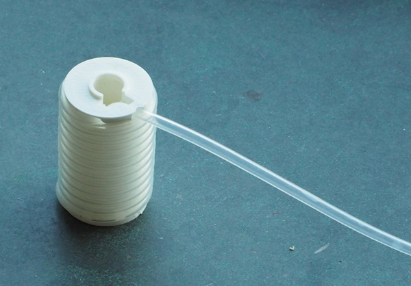

# Project description

A replacement middle part for the Large Flo (e-stim systems electrode).
Allows for simultaneous stim and pressure sensor readings.

# Bill Of Materials

* Large Flo electrode. Not tested on other electrodes from the same manufacturer.
* Silicone tubing (3mm OD, 2mm ID).
* Pressure sensor, such as SparkFun Qwiic MicroPressure Sensor.