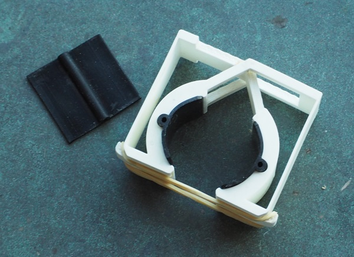
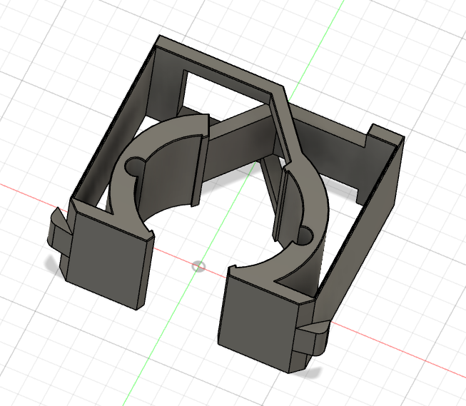
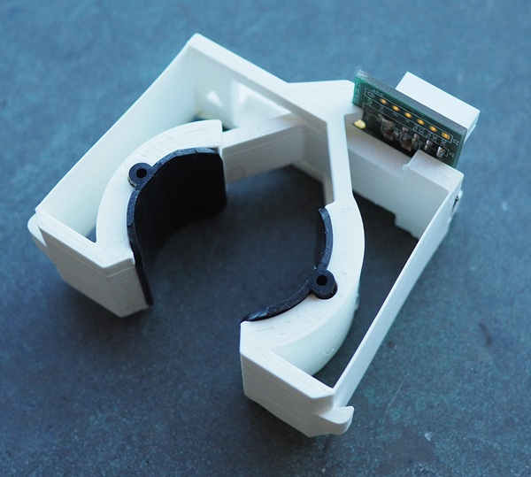
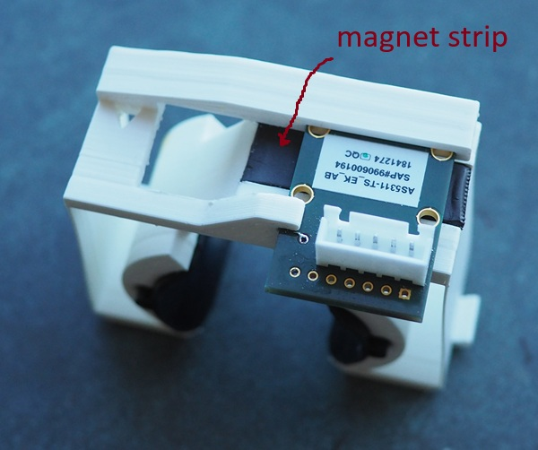
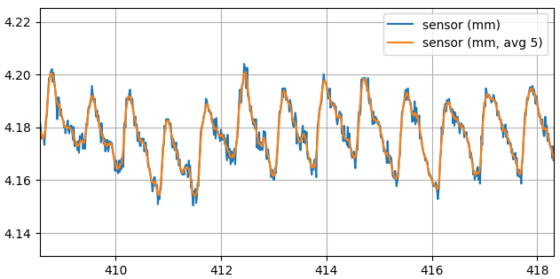
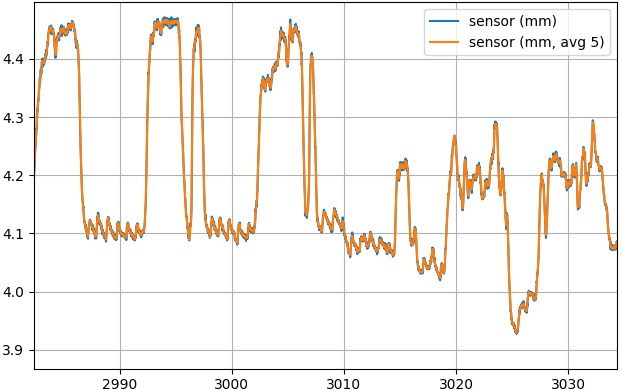
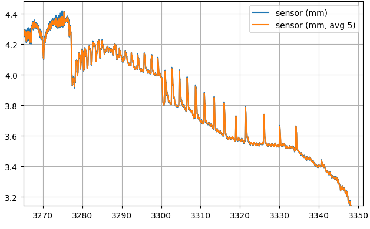

# Project description

A flexure designed to hold 2 sheets of conductive omega rubber
on either side of the shaft. Expands/flexes to comform to your size.

Omega rubber can be purchased at Joanne's estim shop.

# Printing

This part is fairly complicated to print.

If you print in PLA, printing the flexures with 2 walls makes them too
stiff, and standard slicer profiles result in very weak parts if 
the flexures are only 1 wall thick.

I had most luck with prusa slicer, 0.6mm walls, classic perimeter generation.
This results in some minor artifacts in the sensor area.

If you print with more flexible filaments such as PETG, you can get away
with printing 2 wall flexures and avoid all the printing problems
associated with single walls.

# Erection sensor version

Uses AS5311-TS_EK_AB magnetic position sensor. 0.5µm resolution.
I purchased a longer magnet strip from aliexpress.

The sensor is sensitive enough to detect heartbeat and provides
more than enough range for clench detection.

It could be utilized for edge-o-matic type functionality
without invasive sensors.

### Hearbeat:

### clench:

### climax:
