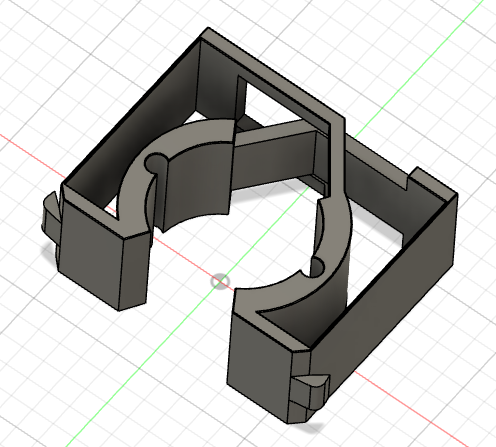
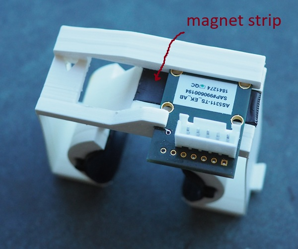

# Project description

A flexure designed to hold 2 sheets of conductive omega rubber
on either side of the shaft. Expands/flexes to comform to your size.

Omega rubber can be purchased at Joanne's estim shop.

# Erection sensor version

Uses AS5311-TS_EK_AB magnetic position sensor. 0.5µm resolution.
I purchased a longer magnet strip from aliexpress.

The sensor is sensitive enough to detect heartbeat and provides
more than enough range for clench detection.

It could be utilized for edge-o-matic type functionality
without invasive sensors.

Hearbeat:

clench:

climax:
