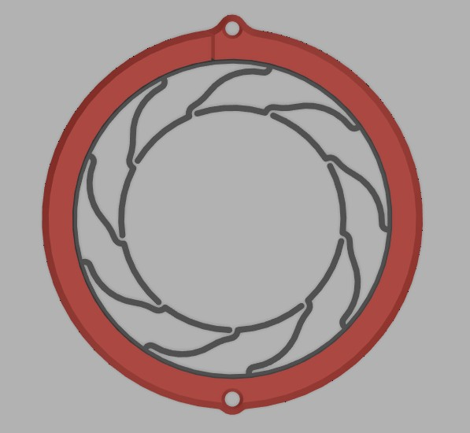
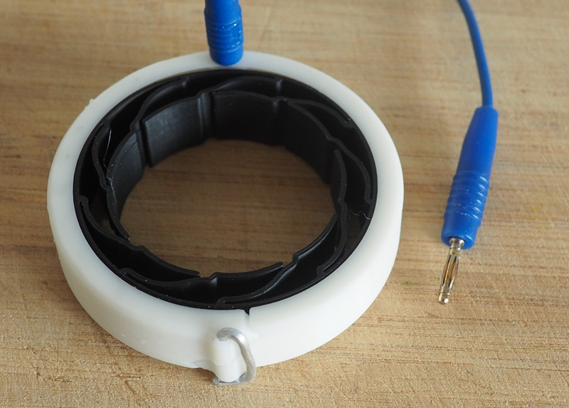
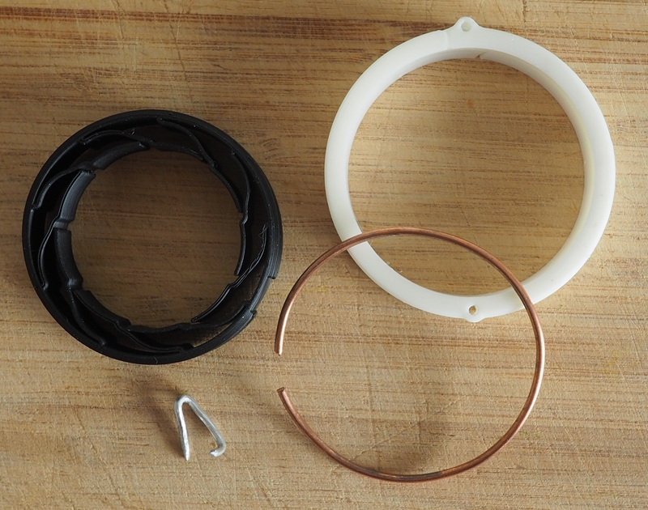

It reminded people of stargate. I don't know why.

This is another flexure-based printed electrode. It follows the design
principle of a highly conductive layer with thin dielectric film. 

A metal wire ensures all segments have equal resistance to the box,
about $500 \Omega$. 
Because of high segment resistance, local variations in skin resistance
have less effect on the current distribution. And because there
are many parallel segments, the overall resistance of the electrode is
low. Less stingy than highly conductive electrodes placed
at the same approximate location.

It was designed for a minimum diameter of 32mm, and can expand to 42mm.
Fusion files included.

# Materials

* 1.7mm diameter solid metal wire. I salvaged some from 16A wire.
* 2mm Banana plug.
* Inner ring: Protopasta conductive PLA or similar. TPU would be ideal, but I don't have any.
* Outer ring: filament of your choice.

# Pics

